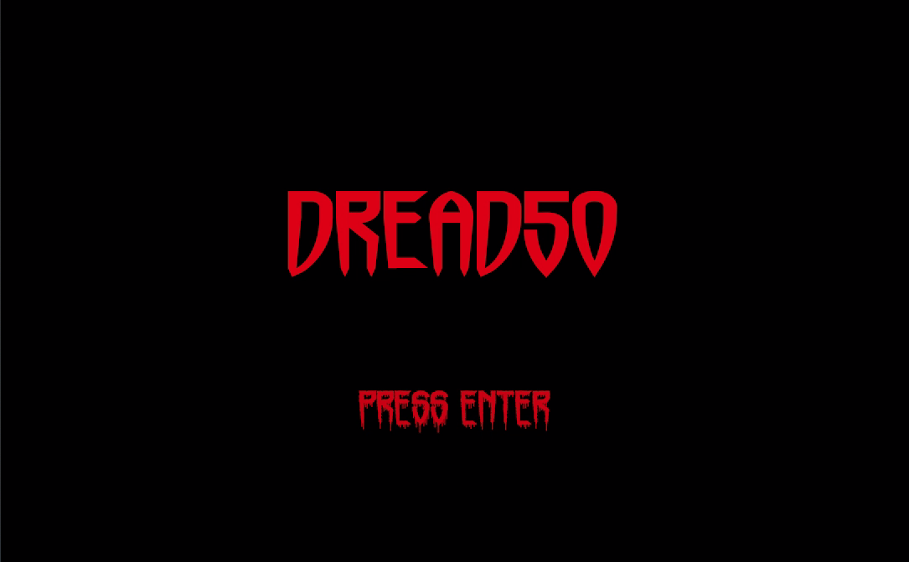
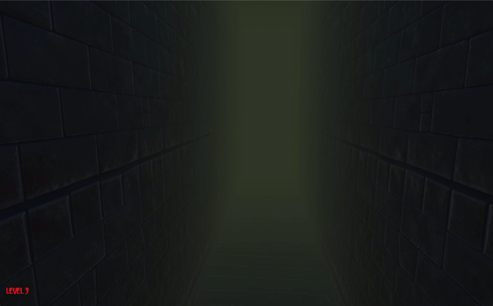
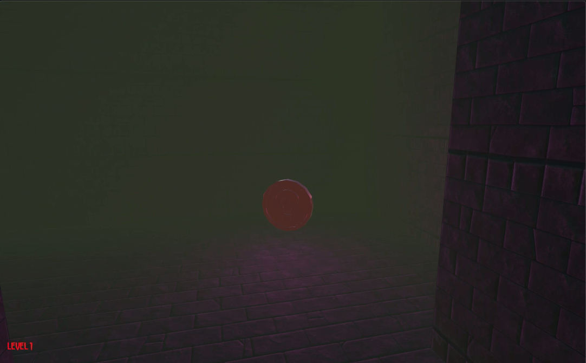
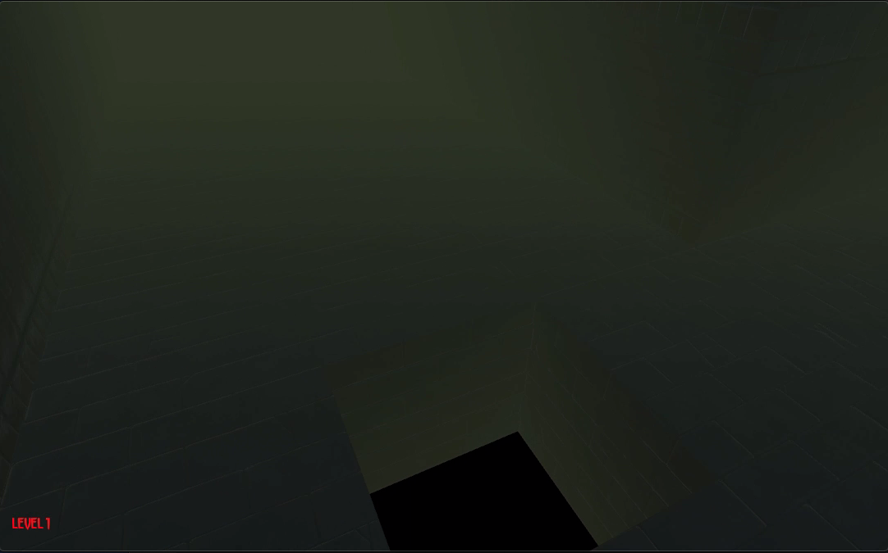
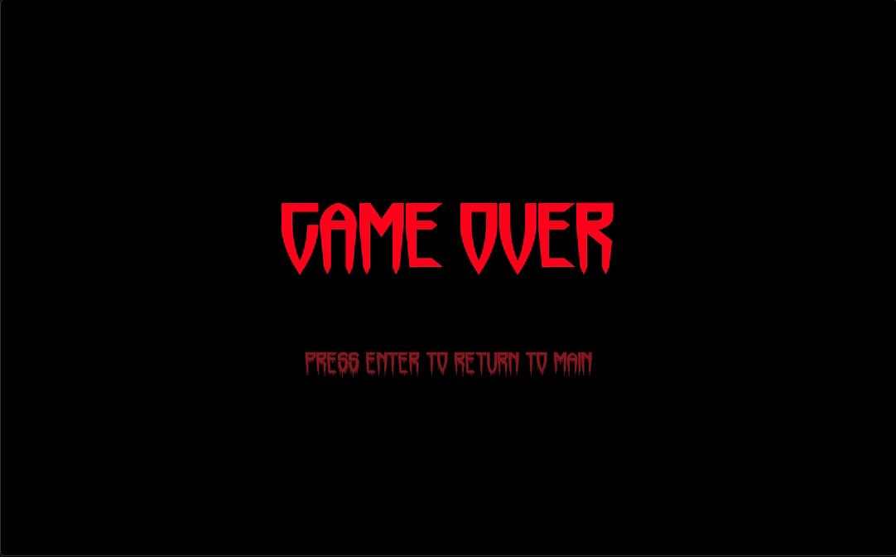

# Dread-50

Project 9 of [CS50's Introduction to Games Development](https://cs50.harvard.edu/games/2018/)

*Dread-50* is a game inspired by the VR game [Dreadhalls](http://www.dreadhalls.com/). 

[Full project specification](https://cs50.harvard.edu/games/2018/projects/9/dreadhalls/).

## Setup
First, clone this repository:
```bash
git clone https://github.com/calumbell/cs50g-helicopter-50
```

Download the [Unity Hub](https://unity3d.com/get-unity/download/) and install v 2018.4. Locate the *cs50g-dread-50* directory in the Unity Hub to open it. Once the project has opened in Unity, press the Play button to test the game.


## Assessment Criteria
- Spawn holes in the floor of the maze that the player can fall through.
- When the player falls through any holes, transition to a “Game Over” screen similar to the Title Screen, implemented as a separate scene.
- Add a Text label to the Play scene that keeps track of which maze they’re in, incrementing each time they progress to the next maze.

## Visuals
You can see a video demonstration of this project [here](https://youtu.be/gp43lzsEcS0).







## Requirements
*Dread-50* was built using the [Unity](https://unity.com/) Game Engine (version 2018.4)
